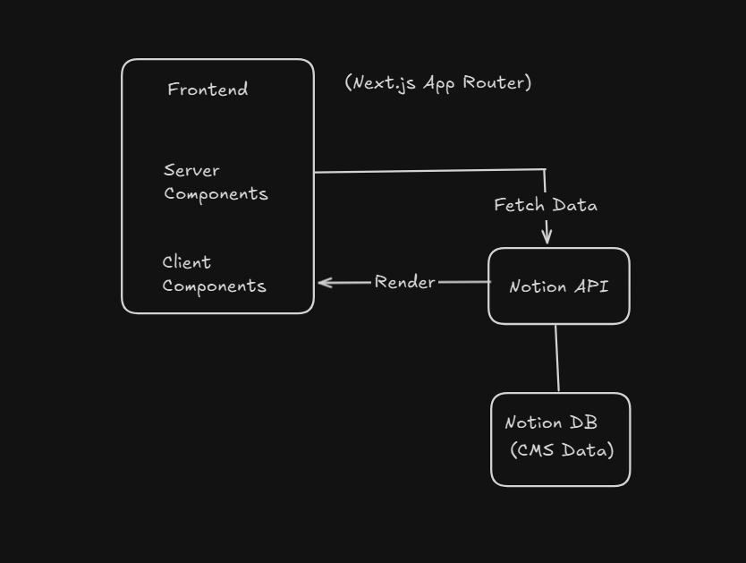
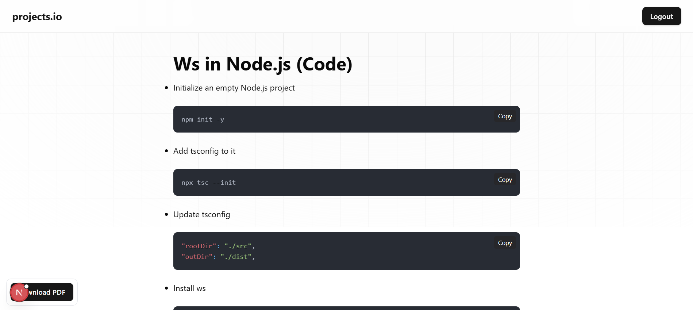
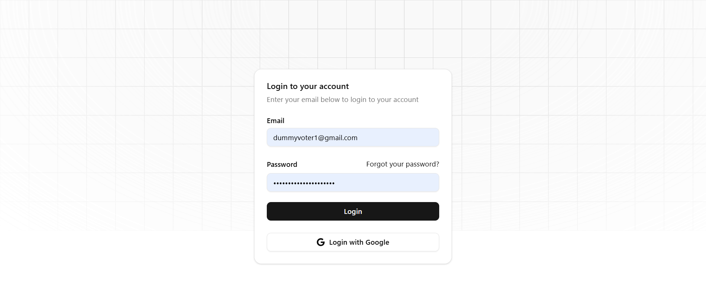
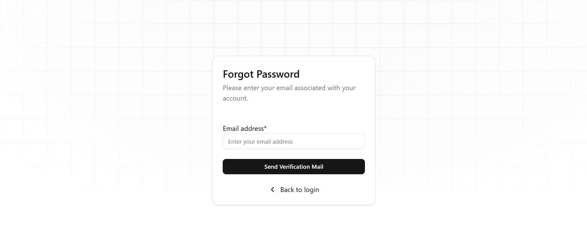

# Fullstack CMS with Notion as Backend 

A modern **Fullstack CMS system** built with **Next.js App Router**, where **Notion acts as the backend CMS** instead of a traditional database.  
This allows non-developers to manage content easily while developers focus on building fast, scalable frontends.

---

##  Features

-  **Authentication with NextAuth**
  - Google OAuth
  - Email & Password login
  - Forgot / Reset Password flow
-  **Notion as a Headless CMS**
  - No traditional backend or database
  - Content managed directly from Notion
-  **Dynamic Blog / Project Pages**
  - Slug-based routing
  - Pagination support
-  **Rich Content Rendering**
  - Supports headings, lists, code blocks, images, etc.
-  **Search & Filtering**
-  **SEO Friendly**
  - Server Components for data fetching
-  **Modern UI**
  - Built with Tailwind CSS
-  **Export Content as PDF**
  - Option to hide header/footer in PDF view

---

##  Why Notion as Backend?

Traditional CMS architecture:
Frontend → API → Database → Admin Panel

This project replaces that with:

Frontend → Notion API → Notion Database

### Benefits:
- No need to build an admin dashboard
- Content editors use Notion directly
- Faster development
- Clean separation of content and UI

---

## High-Level Architecture

## Authentication Flow
User → NextAuth → Google / Credentials → Session

## Data Flow

Content is created in Notion Database
                |
Next.js Server Components fetch data via Notion API
                |
Pages are rendered using:
                |
Metadata from database (title, slug, cover, description)
                |
Body content from Notion blocks
                |
Client Components handle:
                |
Search
                |
Pagination
                |
UI interactions

### Tech Stack
## Frontend

- Next.js (App Router)

- React

- TypeScript

- Tailwind CSS

- Authentication

- NextAuth

- Google OAuth

- Credentials Provider

## CMS / Backend

- Notion API

- Notion Databases

- Notion Blocks API

- Rendering

## Utilities

PDF export

SEO metadata generation

## Project Structure (Simplified)
        app/
        ├─ (auth)/
        │   ├─ login/
        │   ├─ register/
        │   └─ reset-password/
        ├─ (dashboard)/
        |   ├─ dashboard/
        │   └─ track/[...slug]/
        ├─ api/
        |   ├─ auth/
        |   ├─ notion-test/
        |   ├─ pdf/
        │   └─ auth/
        ├─ lib/
        │   ├─ notion.ts
        │   └─ auth.ts
        ├─ components/
        │   ├─ TrackCard.tsx
        │   ├─ NotionRenderer.tsx
        │   └─ SearchClient.tsx
        ├─ globals.css
        ├─ page.tsx
        └─ layout.tsx

## Screenshots

- Home Page

- Notion Content Rendering

- Authentication

- Forgot password

## Environment Variables

Create a .env file:
- add .env.example variables and replace with your keys

### Getting Started
# Install dependencies
npm install

# Run development server
npm run dev

Visit: 

## Future Improvements

- Role-based access control

- Pagination

- Comments system

- Full-text search

- Notion page caching

- Admin analytics

# Author

Anugrah RK